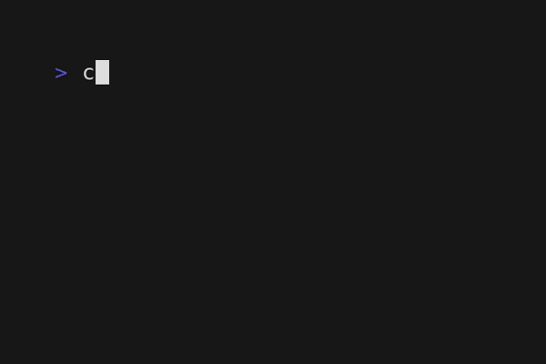

# J-Tetris

This is the current state of a Tetris game in Java I'm working on.

It's a continuation of my completion of [The Tetris with
Java](https://hyperskill.org/projects/339) Hyperskill project. For
example, looking at the commit history, you'll see tags like
`pass-stage-1`, etc, which are supposed to mark the first commit that
passes a given stage of the Hyperskill project.

However, in contrast to what people normally expect Tetris to be, the
Hyperskill version of the project is purely command-line
based. Because of this, I plan on working this into a full-fledged
Java Swing GUI application. Why? To showcase my skills writing Java!
And, to boot, Tetris is a game I enjoyed playing very much when I was
younger, even getting somewhat good at it (though I never [beat
it](https://www.youtube.com/watch?v=POc1Et73WZg)).

## Demo
A GIF demo of the project in action (building, then execution.) The
commands used are explained further below.

## Running the current version
1. Clone locally.
2. Within the top-level project directory: `./gradelw build`, then
3. `java -jar build/libs/J-Tetris.jar`.

The Tetris "interpreter" is ready to accept commands.

## Gameplay
Again, the current form of the project is a command-based CLI
prototype of the real thing, and so a few things need to be explained
beforehand. Hopefully, by the end of this journey, we'll have the
fully-blown GUI Tetris everyone knows and loves, no wonky nitty-gritty
details. 😀

### Starting
First, enter your board's dimensions (width followed by height), then
press Enter. To start the game in earnest, type "piece" and press
Enter.  Then type the name of the first piece that you think should
come down, from one of I, J, L, O, S, T, or Z.

From there, the player is expected to interface with the application
using various keywords, which see below.

When your piece lands, you should select another one with "piece"
again, in the same manner as described above.

### Keywords
- piece
  - Enter a new piece: select from I, J, L, O, S, T, or Z. This
	command only works either at the beginning of the game, or when
	the current piece has landed.
- left, right, rotate
  - Move/rotate the piece.
- down
  - Do nothing (let the piece fall down one space). Note that
	currently, there is currently no "drop" command, as we're used to in classic
	Tetris.
- break
  - In the current state of the project, when the player completes
	lines, she must "claim" them manually, with this command. Of
	course, this will only take effect if there are completed lines in
	the first place. There is currently no scoring system set up.
- exit
  - Exit the game.
  
### Losing the game
As in classic Tetris, you lose whenever you form a stack reaching the
top of the board.

## Roadmap

Some ideas:

- How much do I need to alter things to make it as close to classic
  NES/Game Boy Tetris as possible:
  - How pieces are selected (I know it isn't purely random)
  - Scoring
  - Hyperskill version lacks a "drop" command
  - Music/sound?
  - Fancy art?
  
- Refine the "interpreter" aspect of the project
  - Refactor the command-accepting logic?
	- Support Tetris "scripts" would could then be testable
  - Add a "drop" command before continuing with the GUI code.

## Tetris as a machine

I admire something very specific about how the Hyperskill team
designed the project. Their Tetris project makes you feel like you're
designing an interpreter for a limited, strange sort of machine,
namely, the mechanics of Tetris. This makes things like implementing
the various "events" of Tetris easy (e.g. line completion), since you
don't have to worry about when they're supposed to occur, or what
exactly triggers them: the user enters commands that trigger them.

Also, the fact that it's command-line based lets you focus more on the
what the game should actually do, rather than getting bogged down in
the details of things like event listeners, multithreading, and so on.
